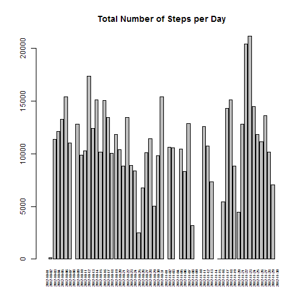
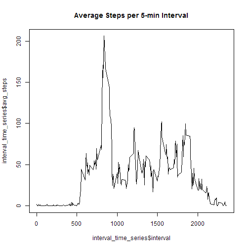
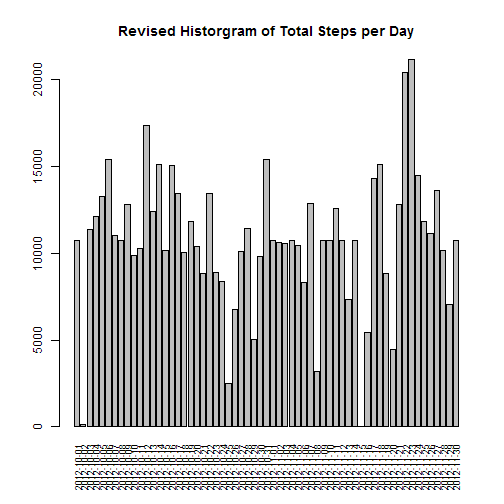
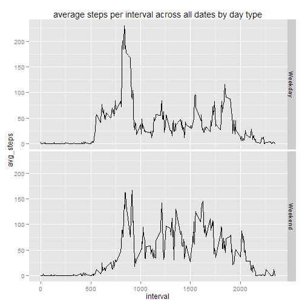

## Loading and preprocessing the data


```r
library(data.table)
```

```
## Warning: package 'data.table' was built under R version 3.1.1
```

```r
library(ggplot2)
```

```
## Warning: package 'ggplot2' was built under R version 3.1.1
```

```r
setwd('~/git_repo/RepData_PeerAssessment1/')
data_file <- 'activity.csv'
dt <- data.table( read.csv(data_file) )
```


## What is mean total number of steps taken per day?

On avereage, the subject was making about 10766 steps a day.


```r
# calcuate total steps per date
sum_by_date <- dt[,list(sum_steps = sum(steps)),by='date']
# calcuate mean and median values for daily total steps
mean_and_median <- sum_by_date[ ,list( mean = mean(sum_steps, na.rm = TRUE), median = median(sum_steps, na.rm = TRUE))]
mean_and_median
```

```
##        mean median
## 1: 10766.19  10765
```


```r
# plot total number of steps per day
barplot(main = "Total Number of Steps per Day", sum_by_date$sum_steps,names.arg=sum_by_date$date, las = 3, cex.axis=1.0, cex.names = 0.5)
```

 


## What is the average daily activity pattern?

The steps made start to be observed right after 5am and peaked at 8:35am. After 8pm, steps made were decreasing rapidly.


```r
# calcuate total and average steps made per interval across all days
interval_time_series <- dt[,list(sum_steps = sum(steps, na.rm = TRUE), avg_steps = mean(steps, na.rm = TRUE)),by='interval']
# plot the time series
plot(interval_time_series$interval, interval_time_series$avg_steps, type = "l", main = "Average Steps per 5-min Interval")
```

 


```r
# identify interval that has highest steps made across all days
max_interval_record <- interval_time_series[,.SD[which.max(sum_steps)]]
max_interval_record
```

```
##    interval sum_steps avg_steps
## 1:      835     10927  206.1698
```


## Imputing missing values

There are 2,304 missing values observed in the dataset.


```r
# calcualte amount of NA rows
sum(is.na(dt$steps))
```

```
## [1] 2304
```

We decided to use the average value of the same interval across all days to fill in the missing value.


```r
# adding in main/raw data.table a new column for average steps per interval across all days
dt <- merge(dt, interval_time_series, by="interval" )
# adding in new columnn for revised steps per interval by replacing NA with average steps per interval across all days
dt <- dt[,new_steps := ifelse(is.na(steps),avg_steps,steps)]
```


Here're the revised historgram of the total number of steps taken each day (orginal missing values filled in with the average value of the same interval across all days)


```r
# adding in summary table a new column for revised daily total steps 
new_sum_by_date <- merge(sum_by_date, dt[,list(new_sum_steps = sum(new_steps)),by='date'], by = "date")
# plot the histogram
barplot(new_sum_by_date$new_sum_steps,names.arg=new_sum_by_date$date, las = 3, cex.axis=1.0, cex.names = 0.75, main = "Revised Historgram of Total Steps per Day")
```

 


Because average interval values were used to fill in the missing values, the revised overall mean and median values did not change much:


```r
# calculating new mean and median values for average daily total steps
mean_and_median_2 <- new_sum_by_date[ ,list( revised_mean = mean(new_sum_steps, na.rm = TRUE), revised_median = median(new_sum_steps, na.rm = TRUE))]
# print result
mean_and_median_2
```

```
##    revised_mean revised_median
## 1:     10766.19       10766.19
```


## Are there differences in activity patterns between weekdays and weekends?

Adding additional column for weekday/weekend variable factor:


```r
# adding column for weekday
dt <- dt[,weekday:=weekdays(as.Date(date))]
# adding column for weekday/weekend variable factor
dt <- dt[,date_type:=ifelse(weekday=="Saturday" | weekday=="Sunday","Weekend","Weekday")]
# count distinct dates by day-type
dt[,list(distinct_date_count=length(unique(date))),by="date_type"]
```

```
##    date_type distinct_date_count
## 1:   Weekday                  45
## 2:   Weekend                  16
```

```r
# adding weekday variables to summary table
new_sum_by_date <- new_sum_by_date[,weekday:=weekdays(as.Date(date))]
new_sum_by_date <- new_sum_by_date[,date_type:=ifelse(weekday=="Saturday" | weekday=="Sunday","Weekend","Weekday")]
```


The mean and median total daily steps are higher during weekends than during weekdays.


```r
# calculate mean and median average total daily steps by day type
mean_and_median_3 <- new_sum_by_date[ ,list( revised_mean = mean(new_sum_steps, na.rm = TRUE), revised_median = median(new_sum_steps, na.rm = TRUE)),by="date_type"]
# print result
mean_and_median_3
```

```
##    date_type revised_mean revised_median
## 1:   Weekday     10255.85          10765
## 2:   Weekend     12201.52          11646
```


Here's the panel plot of the 5-minute interval (x-axis) and the average number of steps taken, averaged across all weekday days or weekend days (y-axis).  It showed the amount of steps were made relatively more evenly across the day during weekends:


```r
# calculate average steps per interval across all dates by day type
interval_time_series_2 <- dt[,list(sum_steps = sum(new_steps, na.rm = TRUE), avg_steps = mean(new_steps, na.rm = TRUE)),by=c('interval','date_type')]
# plot seperate panels
qplot(interval,avg_steps,data = interval_time_series_2,facets = date_type ~ ., main = "average steps per interval across all dates by day type", geom = "line")
```

 

